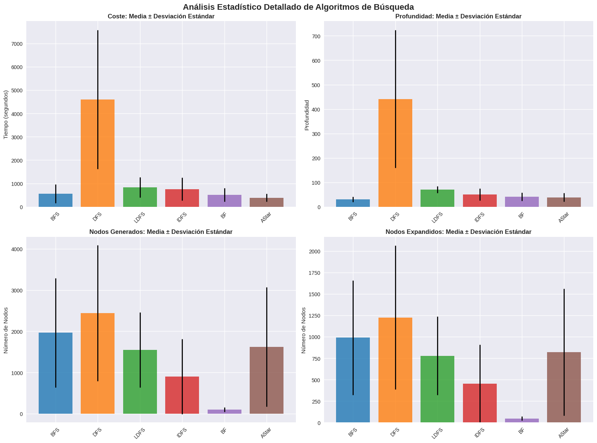
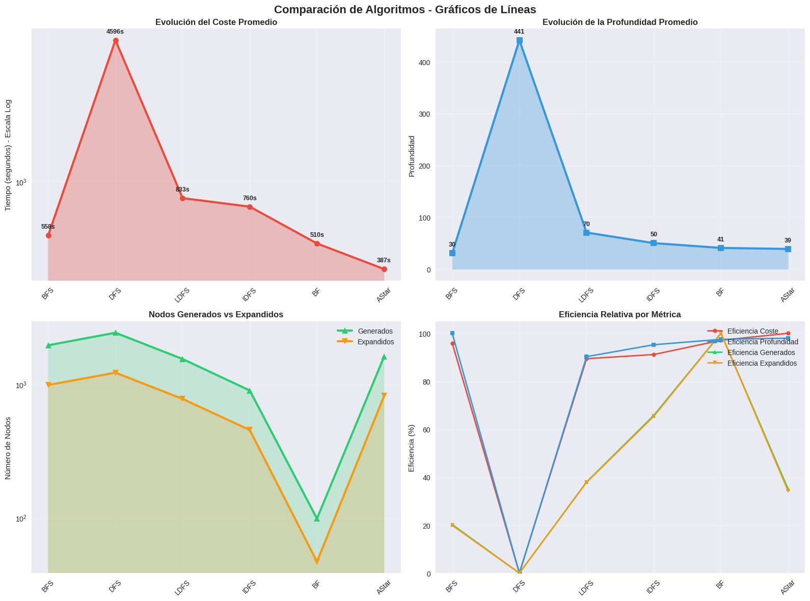
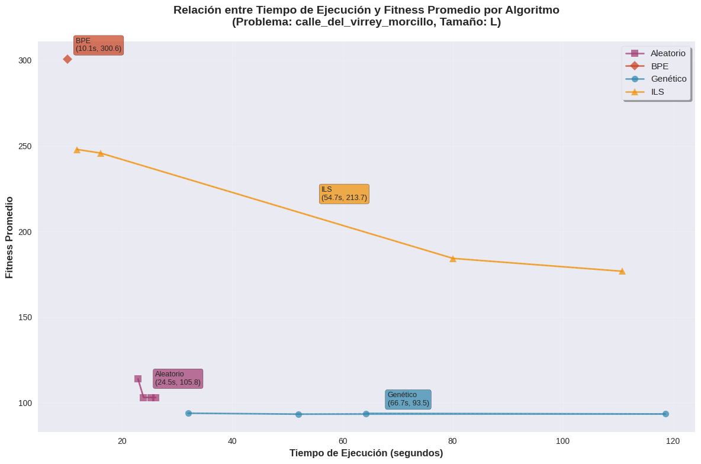
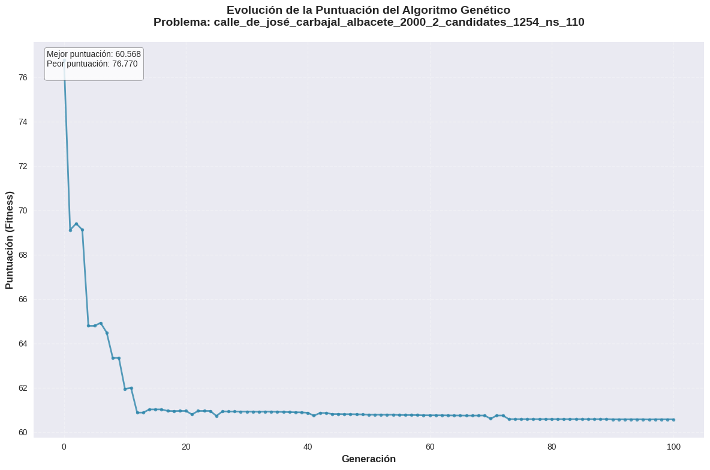

# **Memoria de Prácticas** 

# **Sistemas Inteligentes**

# Fares Francisco Endong Eyenga

Grupo A

[faresfco.endong@alu.uclm.es](mailto:faresfco.endong@alu.uclm.es)

Curso 2024/2025

# Contenidos
- [**Memoria de Prácticas**](#memoria-de-prácticas)
- [**Sistemas Inteligentes**](#sistemas-inteligentes)
- [Fares Francisco Endong Eyenga](#fares-francisco-endong-eyenga)
- [Contenidos](#contenidos)
- [**Resumen**](#resumen)
- [**Práctica 1: Búsqueda en Espacio de Estados**](#práctica-1-búsqueda-en-espacio-de-estados)
  - [**1.1 Introducción**](#11-introducción)
  - [**1.2 Representación del Problema**](#12-representación-del-problema)
  - [**1.3 Estrategias de Búsqueda**](#13-estrategias-de-búsqueda)
    - [**1.3.1 Búsqueda Primero en Anchura(BFS)**](#131-búsqueda-primero-en-anchurabfs)
    - [**1.3.2 Búsqueda Primero en Profundidad(DFS)**](#132-búsqueda-primero-en-profundidaddfs)
    - [**1.3.3 Búsqueda en Profundidad Limitada(LDFS)**](#133-búsqueda-en-profundidad-limitadaldfs)
    - [**1.3.4 Búsqueda en Profundidad Iterativa(IDFS)**](#134-búsqueda-en-profundidad-iterativaidfs)
    - [**1.3.5 Primero Mejor(BF)**](#135-primero-mejorbf)
    - [**1.3.6 A Estrella(AStar)**](#136-a-estrellaastar)
    - [**1.3.7 Organización Jerárquica de las Clases**](#137-organización-jerárquica-de-las-clases)
  - [**1.4 Evaluación Experimental**](#14-evaluación-experimental)
  - [**1.5 Conclusiones** {#1.5-conclusiones}](#15-conclusiones-15-conclusiones)
- [**Práctica 2: Algoritmos Metaheurísticos**](#práctica-2-algoritmos-metaheurísticos)
  - [**2.1 Introducción**](#21-introducción)
  - [**2.2 Representación del Problema**](#22-representación-del-problema)
    - [**2.2.1 Representación**](#221-representación)
    - [**2.2.2 Clases Nuevas**](#222-clases-nuevas)
  - [**2.3 Algoritmos Implementados**](#23-algoritmos-implementados)
    - [**2.3.1 Cambios en A Estrella**](#231-cambios-en-a-estrella)
    - [**2.3.2 Clase Búsqueda Metaheurística**](#232-clase-búsqueda-metaheurística)
    - [**2.3.3 Búsqueda Aleatoria**](#233-búsqueda-aleatoria)
    - [**2.3.4 Hill Climbing e ILS**](#234-hill-climbing-e-ils)
    - [**2.3.5 Algoritmo Genético**](#235-algoritmo-genético)
  - [**2.4 Evaluación Experimental**](#24-evaluación-experimental)
  - [**2.5 Conclusiones**](#25-conclusiones)
- [**Recursos**](#recursos)

# **Resumen**

En esta práctica el objetivo que perseguimos es optimizar el desplazamiento de un origen a un destino (Práctica 1\) en una ciudad ( en este caso Albacete) y el posicionamiento de estaciones de servicio en la misma (Práctica 1). Para conseguir esto nos hemos valido de algoritmos de búsqueda no informada como **Primero en Anchura(BFS), Primero en Profundidad(DFS), Profundidad Limitada(LDFS) y Profundidad Iterativa(IDFS);** también hemos utilizado algoritmos de búsqueda informada como **Primero Mejor(BF)** y **A Estrella(AStar);** y finalmente para las estaciones de servicio hemos utilizado algoritmos metaheurísticos como **Búsqueda por Escalada** y **Algoritmo Genético.** A la par con la implementación se han hecho numerosas pruebas para ver el funcionamiento de estos algoritmos y poder comprobar la calidad de los mismos.

# **Práctica 1: Búsqueda en Espacio de Estados**

## **1.1 Introducción**

En esta práctica el objetivo es, a partir de un servicio de desplazamiento urbano para personas de movilidad reducida, desarrollar un algoritmo para un sistema de conducción inteligente que optimice el camino de un origen a un destino concreto de la ciudad. Para alcanzar este objetivo nos vamos a utilizar algoritmos de búsqueda no informada(Búsqueda en Anchura, Búsqueda en Profundidad, Búsqueda en Profundidad Limitada y Búsqueda en Profundidad Iterativa) y búsqueda heurística (Primero Mejor y A Estrella).

## **1.2 Representación del Problema**

Para poder implementar estos algoritmos nos hemos basado en las siguientes estructuras básicas:

**Clase Nodo**

Representa un nodo en el problema que tratamos de resolver y tiene asociados los siguientes atributos:

* ***Estado:** Es la intersección que representa el nodo*  
* ***Padre:** Es el nodo del que desciende el nodo actual*  
* ***Acción:** Es la acción(movimiento) del nodo padre al nodo actual.*  
* ***Coste:** Valor en tiempo de la acción más el coste de nuestro nodo padre.*  
* ***Profundidad:** Niveles recorridos desde el nodo origen*  
* ***fn:** Función heurística (estimación del coste desde nuestro nodo hasta el objetivo), que se utilizará en la búsqueda informada.*

En esta clase, al igual que las otras que se utilizan a continuación se han sobreescrito los métodos ***\_\_eq()\_\_*** y ***\_\_hash()\_\_*** para mejorar su inserción y acceso en colecciones como conjuntos, diccionarios, listas y tuplas. **En esta clase en concreto se ha sobrescrito además el método \_\_lt()\_\_ para indicar cuando se da el caso qué nodo es menor si se quiere ordenar los nodos dentro de una colección.**

**Clase Estado**

Representa los estados en los que se pueden encontrar los nodos y hace referencia a las intersecciones de las calles en los mapas con los que vamos a trabajar en este problema. Esta clases tiene asociados los siguientes atributos y métodos:

* ***Identificador:** Identifica de forma única la intersección.*  
* ***Longitud:** Representa la longitud de la intersección*  
* ***Latitud:** Representa la latitud de la intersección*  
* ***\_\_hash()\_\_, \_\_eq()\_\_***

**Clase Acción**

Representa los movimientos que puede hacer un nodo desde un estado determinado, en este problema en concreto está asociado a los segments que conectan dos intersecciones. Esta clase tiene asociado los siguientes atributos y métodos:

* ***Origen:** Representa el estado origen de la acción.*  
* ***Destino:** Representa el estado destino de la acción.*  
* ***Distancia:** Representa la distancia entre las dos intersecciones(estados) en metros.*  
* ***Velocidad:** Representa la velocidad máxima a la que se puede ir entre las dos intersecciones, la cual dividimos entre 3.6 para pasarlo a metros/segundo*  
* ***Coste:** Representa la relación entre la distancia y la velocidad.*

**Clase Problema**

Esta clase es la que utilizamos para construir la implementación de los algoritmos así como transformar los datos que leemos del json a las estructuras que hemos definido anteriormente, ya que con ellas vamos a trabajar. Esta clase tiene asociados los siguientes atributos y métodos:

* ***Acciones:** Representa un diccionario de todas las acciones posibles del problema que vamos a tratar.*  
* ***Estados:** Representa un diccionario de todos los estados posibles del problema con el que vamos a trabajar, **tanto en este atributo como en el anterior utilizamos defaultdict() para un mejor manejo de los errores en caso de no encontrar lo que buscamos en el diccionario.***  
* ***Estado inicial:** Representa el estado origen de nuestra ruta, donde partimos.*  
* ***Estado final:** Representa el estado final de nuestra ruta, donde queremos llegar.*  
* ***Velocidad máxima:** Representa la velocidad más alta a la que podemos movernos en el problema.*  
* ***procesar\_datos():** En este método nos encargamos de transformar la información del fichero json, primero procesamos las intersecciones y las vamos guardando en la lista de estados, luego los segments en acciones asegurándonos de que no hay ninguna acción con velocidad menor o igual que cero y finalmente actualizamos la velocidad máxima; concluimos ordenando todas las acciones por su estado origen pues nos va a facilitar más adelante la expansión de nodos.*

**Es importante tener en cuenta que para los estados y las acciones hemos utilizado diccionarios dado que el orden de complejidad para las búsquedas es mucho menor que si utilizamos listas por ejemplo, ya que los diccionarios son colecciones que usan tablas hash, no va a recorrer toda la estructura para encontrar algo.**

## **1.3 Estrategias de Búsqueda**

Para poder trabajar de forma ordenada y eficiente con los algoritmos de búsqueda se ha creado la clase abstracta ***Búsqueda*** donde encontramos toda la lógica común a todos los algoritmos de búsqueda con los que vamos a trabajar. Entre los atributos (que van a compartir todos los métodos que hereden de ella) de esta clase tenemos, **nodos generados, nodo expandidos, coste, tamaño de la solución(profundidad), problema, cerrados(estados visitados), frontera(lista de abiertos).**

En esta clase encontramos métodos como:

* ***generar\_solucion()*****:** en el que obtenemos todo el camino de nodos recorrido desde el origen hasta el destino,  
* ***expandir\_nodo():*** donde generamos los sucesores de un nodo a partir de las acciones posibles de este comprobando además si hemos encontrado el objetivo, para este método hemos utilizado una lista de sucesores para mantener el orden en que se insertan  
* ***buscar():*** Aquí es donde está la lógica que hace funcionar los algoritmos informados y no informados. Primero inicializamos la frontera(cada algoritmo lo hará a su manera) insertando el estado inicial, luego extraemos el nodo de la frontera, comprobamos si es el objetivo, si no lo es comprobamos si está en la lista de cerrados, si no es así, lo expandimos y seguimos con sus sucesores.

**Cada algoritmo tendrá su forma de inicializar la frontera**(cuando se inicializa el objeto)**, insertar y extraer los nodos**. Y también tenemos las clases **Búsqueda no Informada** y **Búsqueda Informada** que son las clases abstractas base para cada tipo de algoritmo, se diferencian más que nada en que uno tiene el método **calcular\_heuristica()** y el otro no.

### **1.3.1 Búsqueda Primero en Anchura(BFS)**

En la implementación primero hemos utilizado la **frontera** como una **deque**, que es una estructura que nos permite añadir elementos al principio o al final de la misma, lo que nos permite seguir el orden **FIFO** requerido para este algoritmo, las **inserciones** se hacen al principio con ***popleft()*** y las **extracciones** siempre son de los nodos más antiguos añadidos, **ordenaremos los nodos según su identificador en orden creciente antes de insertarlos para garantizar una expansión de nodos más consistente.**

### **1.3.2 Búsqueda Primero en Profundidad(DFS)**

Es otro algoritmo de búsqueda no informada parecido al de búsqueda primero en profundidad pero en este primero se expande el nodo de mayor profundidad, también hemos utilizado **deque** al i**nicializar la frontera** para implementar el orden **LIFO** con **append()** para las inserciones al final y **pop()** para las extracciones también al final **,** antes de insertar los nodos los ordenamos según el identificador de estado.

### **1.3.3 Búsqueda en Profundidad Limitada(LDFS)**

Es una variante de la búsqueda en profundidad en la que hay una profundidad tope establecida. ***La única diferencia en nuestra implementación respecto a la búsqueda en profundidad original está en comprobar si el nodo no está en la lista de sucesores y que no se ha superado la profundidad máxima.*** La gestión de la frontera y de cerrados es igual que en el algoritmo original.

### **1.3.4 Búsqueda en Profundidad Iterativa(IDFS)**
Es otra variante de la búsqueda en profundidad, en este caso lo que se hace es ir incrementando gradualmente la profundidad a medida que se exploran los niveles hasta encontrar el objetivo. **En nuestra implementación lo que hacemos es llamar a profundidad limitada de forma iterativa incrementando la profundidad en cada llamada.** Para ello para cada iteración creamos una instancia de la clase LDFS y llamamos a su método **buscar()** y luego obtenemos la solución así como sus atributos (nodos generados, nodos expandidos, tamaño de la solución y el coste) y se lo asignamos a nuestro objeto de la clase IDFS.

### **1.3.5 Primero Mejor(BF)**

En nuestra implementación**, para inicializar la frontera hemos utilizado una cola de prioridad,** es una estructura que nos permite almacenar los nodos en función de una prioridad que en este caso es el valor de la función heurística, aquí el primero elemento es el nodo raíz con función heurística 0\. En esta clase **para insertar los nodos** primero calculamos la función heurística de cada uno con el método **calcular\_heuristica()** en el que nos valemos de la **distancia geodésica** para conseguirlo y luego calculamos el valor de la función para cada nodo.

**Para la búsqueda** llamamos al método **buscar()** de la clase padre y **para la extracción** obtenemos el primero de los elementos de la cola de prioridad ya que está ordenado de forma creciente por el valor de la función heurística de cada nodo, de tal forma que el que menor valor tenga es el más cercano al objetivo.

### **1.3.6 A Estrella(AStar)**

Es muy parecido al algoritmo primero mejor pero en este caso no sólo se tiene en cuenta el coste de llegar al final sino también el coste de llegar al nodo actual, ***la principal diferencia en nuestra implementación respecto a Primero Mejor es que en calcular\_heuristica() le sumamos a la distancia geodésica el coste de nuestro nodo,*** el resto de la implementación es igual que en Primero Mejor

### **1.3.7 Organización Jerárquica de las Clases**

**Clase Nodo**

**Clase Estado**

**Clase Acción**

**Clase Problema**

**Clase Búsqueda**

* **Búsqueda No Informada**  
  * Primero en Anchura (BFS)  
  * Primero En Profundidad (DFS)  
  * Primero en Profundidad Limitada (LDFS)  
  * Primero en Profundidad Iterativa (IDFS)  
* **Búsqueda Informada**  
  * Primero Mejor (BF)  
  * A Estrella (AStar)

## **1.4 Evaluación Experimental**

Para la evaluación experimental nos vamos a centrar en los problemas **huge** concretamente ***calle\_agustina\_aroca\_albacete*** y de ellos vamos a ir variando los estados origen y destino, para la semilla utilizaremos el 3\. 

| Problema | calle\_agustina\_aroca\_albacete |  |  |  |  |  |
| :---- | :---: | ----- | ----- | ----- | ----- | ----- |
| Origen | 1540051673 |  |  |  |  |  |
| Destino | 1565984499 |  |  |  |  |  |
| Algoritmo | Coste | Coste(s) | Profundidad | Generados | Expandidos | Tiempo |
| Búsqueda en Anchura | 0:6:5.0234 | 365,02 | 32 | 1466 | 731 | 0:0:0.0019 |
| Búsqueda en Profundidad | 0:21:42.4182 | 1.302,42 | 141 | 331 | 160 | 0:0:0.0006 |
| Profundidad Limitada(80) | 0:15:59.3467 | 959,35 | 80 | 698 | 345 | 0:0:0.0011 |
| Profundidad Iterativa | 0:15:59.3467 | 959,35 | 80 | 698 | 345 | 0:0:0.0539 |
| Primero Mejor | 0:7:25.5116 | 445,51 | 55 | 122 | 63 | 0:0:0.0101 |
| A Estrella | 0:5:56.6463 | 356,65 | 55 | 1683 | 831 | 0:0:0.1677 |

| Origen | 30050495 |  |  |  |  |  |
| :---- | :---: | ----- | ----- | ----- | ----- | ----- |
| Destino | 429595692 |  |  |  |  |  |
| Algoritmo | Coste | Coste(s) | Profundidad | Generados | Expandidos | Tiempo |
| Búsqueda en Anchura | 0:5:22.0848 | 322,08 | 16 | 161 | 93 | 0:0:0.0022 |
| Búsqueda en Profundidad | 1:44:7.1143 | 6.247,11 | 570 | 2186 | 1092 | 0:0:0.0106 |
| Profundidad Limitada(80) | 0:9:47.3959 | 587,40 | 47 | 2099 | 1051 | 0:0:0.0068 |
| Profundidad Iterativa | 0:5:44.4699 | 344,47 | 17 | 136 | 75 | 0:0:0.0008 |
| Primero Mejor | 0:5:22.0848 | 322,08 | 16 | 27 | 17 | 0:0:0.0029 |
| A Estrella | 0:5:22.0848 | 322,08 | 16 | 250 | 130 | 0:0:0.0174 |

| Origen | 11787944276 |  |  |  |  |  |
| :---- | :---: | ----- | ----- | ----- | ----- | ----- |
| Destino | 11388420398 |  |  |  |  |  |
| Algoritmo | Coste | Coste(s) | Profundidad | Generados | Expandidos | Tiempo |
| Búsqueda en Anchura | 0:6:56.2684 | 416,27 | 38 | 3848 | 1930 | 0:0:0.0091 |
| Búsqueda en Profundidad | 0:28:59.8639 | 1.739,86 | 212 | 511 | 265 | 0:0:0.0007 |
| Profundidad Limitada(80) | N/A | N/A | 80 | 2033 | 1022 | 0:0:0.0070 |
| Profundidad Iterativa | 0:9:11.9752 | 551,98 | 66 | 1560 | 806 | 0:0:0.1250 |
| Primero Mejor | 0:5:49.0011 | 349,00 | 47 | 119 | 58 | 0:0:0.0489 |
| A Estrella | 0:5:16.5684 | 316,57 | 42 | 2588 | 1336 | 0:0:0.1818 |

| Origen | 30050498 |  |  |  |  |  |
| :---- | :---: | ----- | ----- | ----- | ----- | ----- |
| Destino | 11760297099 |  |  |  |  |  |
| Algoritmo | Coste | Coste(s) | Profundidad | Generados | Expandidos | Tiempo |
| Búsqueda en Anchura | 0:19:40.4031 | 1.180,40 | 33 | 2319 | 1173 | 0:0:0.0075 |
| Búsqueda en Profundidad | 1:10:33.2974 | 4.233,30 | 336 | 1553 | 763 | 0:0:0.0050 |
| Profundidad Limitada(80) | N/A | N/A | 80 | 3214 | 1619 | 0:0:0.0105 |
| Profundidad Iterativa | 0:22:7.1410 | 1.327,14 | 61 | 3170 | 1600 | 0:0:0.4035 |
| Primero Mejor | 0:13:28.9525 | 808,95 | 37 | 79 | 40 | 0:0:0.0221 |
| A Estrella | 0:10:58.0710 | 658,07 | 65 | 4540 | 2336 | 0:0:0.4863 |

| Origen | 30203521 |  |  |  |  |  |
| :---- | :---: | ----- | ----- | ----- | ----- | ----- |
| Destino | 11760297098 |  |  |  |  |  |
| Algoritmo | Coste | Coste(s) | Profundidad | Generados | Expandidos | Tiempo |
| Búsqueda en Anchura | 0:21:11.9705 | 1.271,97 | 38 | 3108 | 1564 | 0:0:0.0040 |
| Búsqueda en Profundidad | 1:5:53.2821 | 3.953,28 | 317 | 1523 | 743 | 0:0:0.0024 |
| Profundidad Limitada(80) | N/A | N/A | 80 | 3425 | 1732 | 0:0:0.0043 |
| Profundidad Iterativa | 0:23:44.1034 | 1.424,10 | 68 | 1870 | 920 | 0:0:0.0910 |
| Primero Mejor | 0:12:10.9679 | 730,97 | 72 | 151 | 72 | 0:0:0.0115 |
| A Estrella | 0:10:14.7836 | 614,78 | 73 | 4079 | 2083 | 0:10:14.7836 |

| Origen | 30249259 |  |  |  |  |  |
| :---- | :---: | ----- | ----- | ----- | ----- | ----- |
| Destino | 11585231481 |  |  |  |  |  |
| Algoritmo | Coste | Coste(s) | Profundidad | Generados | Expandidos | Tiempo |
| Búsqueda en Anchura | 0:5:13.3745 | 313,37 | 30 | 1511 | 753 | 0:0:0.0016 |
| Búsqueda en Profundidad | 0:30:37.8098 | 1.837,81 | 162 | 561 | 264 | 0:0:0.0010 |
| Profundidad Limitada(80) | N/A | N/A | 80 | 2892 | 1445 | 0:0:0.0029 |
| Profundidad Iterativa | 0:6:48.6661 | 408,67 | 41 | 839 | 403 | 0:0:0.0234 |
| Primero Mejor | 0:5:11.7926 | 311,79 | 34 | 74 | 37 | 0:0:0.0052 |
| A Estrella | 0:5:11.7926 | 311,79 | 34 | 746 | 376 | 0:0:0.0438 |

| Origen | 30249373 |  |  |  |  |  |
| :---- | :---: | ----- | ----- | ----- | ----- | ----- |
| Destino | 11404296430 |  |  |  |  |  |
| Algoritmo | Coste | Coste(s) | Profundidad | Generados | Expandidos | Tiempo |
| Búsqueda en Anchura | 0:7:48.2108 | 468,21 | 24 | 1503 | 761 | 0:0:0.0021 |
| Búsqueda en Profundidad | 0:15:2.1229 | 902,12 | 46 | 5305 | 2689 | 0:0:0.0074 |
| Profundidad Limitada(80) | 0:15:2.1229 | 902,12 | 46 | 1350 | 659 | 0:0:0.0032 |
| Profundidad Iterativa | 0:15:2.1229 | 902,12 | 46 | 88 | 56 | 0:0:0.0193 |
| Primero Mejor | 0:21:58.3947 | 1.318,39 | 58 | 143 | 67 | 0:0:0.0108 |
| A Estrella | 0:7:48.2108 | 468,21 | 24 | 486 | 260 | 0:0:0.0304 |

| Origen | 30249377 |  |  |  |  |  |
| :---- | :---: | ----- | ----- | ----- | ----- | ----- |
| Destino | 11404296427 |  |  |  |  |  |
| Algoritmo | Coste | Coste(s) | Profundidad | Generados | Expandidos | Tiempo |
| Búsqueda en Anchura | 0:7:23.6770 | 443,68 | 22 | 1094 | 566 | 0:0:0.0016 |
| Búsqueda en Profundidad | 0:11:38.0140 | 698,01 | 36 | 5299 | 2687 | 0:0:0.0062 |
| Profundidad Limitada(80) | 0:11:38.0140 | 698,01 | 36 | 1035 | 488 | 0:0:0.0014 |
| Profundidad Iterativa | 0:11:38.0140 | 698,01 | 36 | 63 | 41 | 0:0:0.0111 |
| Primero Mejor | 0:7:23.6770 | 443,68 | 22 | 36 | 23 | 0:0:0.0023 |
| A Estrella | 0:7:23.6770 | 443,68 | 22 | 143 | 83 | 0:0:0.0108 |

| Origen | 40116489 |  |  |  |  |  |
| :---- | :---: | ----- | ----- | ----- | ----- | ----- |
| Destino | 265487214 |  |  |  |  |  |
| Algoritmo | Coste | Coste(s) | Profundidad | Generados | Expandidos | Tiempo |
| Búsqueda en Anchura | 0:3:18.0420 | 198,04 | 22 | 884 | 423 | 0:0:0.0016 |
| Búsqueda en Profundidad | 0:51:52.7910 | 3.112,79 | 306 | 1457 | 714 | 0:0:0.0029 |
| Profundidad Limitada(80) | N/A | N/A | 80 | 1037 | 514 | 0:0:0.0012 |
| Profundidad Iterativa | 0:5:49.1822 | 349,18 | 40 | 909 | 446 | 0:0:0.0111 |
| Primero Mejor | 0:4:40.3221 | 280,32 | 35 | 77 | 46 | 0:0:0.0045 |
| A Estrella | 0:3:15.1985 | 195,20 | 24 | 837 | 397 | 0:0:0.0517 |

| Origen | 1845484942 |  |  |  |  |  |
| :---- | :---: | ----- | ----- | ----- | ----- | ----- |
| Destino | 1255528488 |  |  |  |  |  |
| Algoritmo | Coste | Coste(s) | Profundidad | Generados | Expandidos | Tiempo |
| Búsqueda en Anchura | 0:1:42.2281 | 102,23 | 12 | 412 | 217 | 0:0:0.0003 |
| Búsqueda en Profundidad | 1:28:19.8873 | 5.299,89 | 568 | 2194 | 1099 | 0:0:0.0015 |
| Profundidad Limitada(80) | 0:6:24.6816 | 384,68 | 45 | 2200 | 1113 | 0:0:0.0016 |
| Profundidad Iterativa | 0:2:2.6021 | 122,60 | 12 | 207 | 112 | 0:0:0.0007 |
| Primero Mejor | 0:2:2.6021 | 122,60 | 12 | 22 | 12 | 0:0:0.0011 |
| A Estrella | 0:1:42.2281 | 102,23 | 12 | 233 | 125 | 0:0:0.0122 |

| Origen | 1537103773 |  |  |  |  |  |
| :---- | :---: | ----- | ----- | ----- | ----- | ----- |
| Destino | 2879354499 |  |  |  |  |  |
| Algoritmo | Coste | Coste(s) | Profundidad | Generados | Expandidos | Tiempo |
| Búsqueda en Anchura | 0:18:13.3814 | 1.093,38 | 31 | 2878 | 1460 | 0:0:0.0024 |
| Búsqueda en Profundidad | 0:41:19.1668 | 2.479,17 | 225 | 5108 | 2583 | 0:0:0.0037 |
| Profundidad Limitada(80) | 0:18:11.8839 | 1.091,88 | 80 | 1697 | 854 | 0:0:0.0014 |
| Profundidad Iterativa | 0:18:42.2695 | 1.122,27 | 70 | 1195 | 611 | 0:0:0.0170 |
| Primero Mejor | 0:12:43.2835 | 763,28 | 45 | 106 | 46 | 0:0:0.0057 |
| A Estrella | 0:10:23.9776 | 623,98 | 60 | 1848 | 919 | 0:0:0.1046 |

| Origen | 1721956375 |  |  |  |  |  |
| :---- | :---: | ----- | ----- | ----- | ----- | ----- |
| Destino | 4404600179 |  |  |  |  |  |
| Algoritmo | Coste | Coste(s) | Profundidad | Generados | Expandidos | Tiempo |
| Búsqueda en Anchura | 0:7:56.3473 | 476,35 | 27 | 646 | 329 | 0:0:0.0006 |
| Búsqueda en Profundidad | 1:30:22.8987 | 5.422,90 | 562 | 2142 | 1072 | 0:0:0.0017 |
| Profundidad Limitada(80) | N/A | N/A | 80 | 1138 | 598 | 0:0:0.0010 |
| Profundidad Iterativa | 0:8:24.7464 | 504,75 | 34 | 1012 | 511 | 0:0:0.0082 |
| Primero Mejor | 0:7:59.8056 | 479,81 | 29 | 56 | 30 | 0:0:0.0035 |
| A Estrella | 0:7:17.7621 | 437,76 | 28 | 444 | 212 | 0:0:0.0248 |

| Origen | 2006872098 |  |  |  |  |  |
| :---- | :---: | ----- | ----- | ----- | ----- | ----- |
| Destino | 434371973 |  |  |  |  |  |
| Algoritmo | Coste | Coste(s) | Profundidad | Generados | Expandidos | Tiempo |
| Búsqueda en Anchura | 0:14:9.3534 | 849,35 | 28 | 2018 | 1013 | 0:0:0.0015 |
| Búsqueda en Profundidad | 0:25:50.8972 | 1.550,90 | 87 | 214 | 102 | 0:0:0.0002 |
| Profundidad Limitada(80) | 0:25:36.7506 | 1.536,75 | 81 | 289 | 138 | 0:0:0.0002 |
| Profundidad Iterativa | 0:21:52.7936 | 1.312,79 | 51 | 159 | 69 | 0:0:0.0249 |
| Primero Mejor | 0:13:52.5633 | 832,56 | 41 | 109 | 43 | 0:0:0.0066 |
| A Estrella | 0:9:31.0322 | 571,03 | 43 | 936 | 454 | 0:0:0.0574 |

| Origen | 2918545278 |  |  |  |  |  |
| :---- | :---: | ----- | ----- | ----- | ----- | ----- |
| Destino | 335607956 |  |  |  |  |  |
| Algoritmo | Coste | Coste(s) | Profundidad | Generados | Expandidos | Tiempo |
| Búsqueda en Anchura | 0:10:8.2357 | 608,24 | 41 | 3365 | 1686 | 0:0:0.0028 |
| Búsqueda en Profundidad | 2:20:12.4522 | 8.412,45 | 812 | 4211 | 2120 | 0:0:0.0031 |
| Profundidad Limitada(80) | N/A | N/A | 80 | 734 | 383 | 0:0:0.0006 |
| Profundidad Iterativa | 0:11:48.5095 | 708,51 | 79 | 997 | 524 | 0:0:0.0482 |
| Primero Mejor | 0:7:29.8186 | 449,82 | 56 | 181 | 89 | 0:0:0.0101 |
| A Estrella | 0:5:51.6848 | 351,68 | 51 | 1528 | 801 | 0:0:0.0875 |

| Origen | 1674847668 |  |  |  |  |  |
| :---- | :---: | ----- | ----- | ----- | ----- | ----- |
| Destino | 1529476616 |  |  |  |  |  |
| Algoritmo | Coste | Coste(s) | Profundidad | Generados | Expandidos | Tiempo |
| Búsqueda en Anchura | 0:10:42.6117 | 642,61 | 41 | 2738 | 1353 | 0:0:0.0019 |
| Búsqueda en Profundidad | 1:32:8.3491 | 5.528,35 | 506 | 2005 | 996 | 0:0:0.0014 |
| Profundidad Limitada(80) | N/A | N/A | 80 | 3138 | 1529 | 0:0:0.0024 |
| Profundidad Iterativa | 0:14:57.6883 | 897,69 | 78 | 3300 | 1637 | 0:0:0.0117 |
| Primero Mejor | 0:10:58.1994 | 658,20 | 50 | 123 | 51 | 0:0:0.0068 |
| A Estrella | 0:7:55.9305 | 475,93 | 53 | 2081 | 1051 | 0:0:0.1203 |

| Origen | 1526705351 |  |  |  |  |  |
| :---- | :---: | ----- | ----- | ----- | ----- | ----- |
| Destino | 1676572182 |  |  |  |  |  |
| Algoritmo | Coste | Coste(s) | Profundidad | Generados | Expandidos | Tiempo |
| Búsqueda en Anchura | 0:2:9.8633 | 129,86 | 10 | 259 | 130 | 0:0:0.0002 |
| Búsqueda en Profundidad | 0:45:47.1502 | 2.747,15 | 262 | 869 | 405 | 0:0:0.0006 |
| Profundidad Limitada(80) | 0:13:33.2917 | 813,29 | 81 | 982 | 506 | 0:0:0.0007 |
| Profundidad Iterativa | 0:2:9.8633 | 129,86 | 10 | 100 | 48 | 0:0:0.0004 |
| Primero Mejor | 0:2:20.0831 | 140,08 | 17 | 42 | 17 | 0:0:0.0023 |
| A Estrella | 0:2:6.8983 | 126,90 | 11 | 298 | 154 | 0:0:0.0167 |

| Origen | 1838967432 |  |  |  |  |  |
| :---- | :---: | ----- | ----- | ----- | ----- | ----- |
| Destino | 1846794093 |  |  |  |  |  |
| Algoritmo | Coste | Coste(s) | Profundidad | Generados | Expandidos | Tiempo |
| Búsqueda en Anchura | 0:3:46.1877 | 226,19 | 23 | 1097 | 580 | 0:0:0.0008 |
| Búsqueda en Profundidad | 3:2:12.1486 | 10.932,15 | 930 | 3830 | 1944 | 0:0:0.0027 |
| Profundidad Limitada(80) | 0:9:2.3441 | 542,34 | 66 | 361 | 195 | 0:0:0.0003 |
| Profundidad Iterativa | 0:6:35.2985 | 395,30 | 41 | 195 | 104 | 0:0:0.0080 |
| Primero Mejor | 0:4:6.5383 | 246,54 | 29 | 61 | 29 | 0:0:0.0033 |
| A Estrella | 0:3:46.1877 | 226,19 | 23 | 1063 | 556 | 0:0:0.0584 |

| Origen | 5446305882 |  |  |  |  |  |
| :---- | :---: | ----- | ----- | ----- | ----- | ----- |
| Destino | 1293940908 |  |  |  |  |  |
| Algoritmo | Coste | Coste(s) | Profundidad | Generados | Expandidos | Tiempo |
| Búsqueda en Anchura | 0:13:44.4849 | 824,48 | 34 | 1381 | 666 | 0:0:0.0009 |
| Búsqueda en Profundidad | 0:28:23.4877 | 1.703,49 | 150 | 337 | 176 | 0:0:0.0002 |
| Profundidad Limitada(80) | 0:12:6.9354 | 726,94 | 75 | 617 | 329 | 0:0:0.0004 |
| Profundidad Iterativa | 0:11:1.0849 | 661,08 | 42 | 357 | 192 | 0:0:0.0098 |
| Primero Mejor | 0:10:24.7998 | 624,80 | 58 | 141 | 68 | 0:0:0.0073 |
| A Estrella | 0:7:44.5111 | 464,51 | 41 | 836 | 412 | 0:0:0.0471 |

| Origen | 1543094598 |  |  |  |  |  |
| :---- | :---: | ----- | ----- | ----- | ----- | ----- |
| Destino | 335720318 |  |  |  |  |  |
| Algoritmo | Coste | Coste(s) | Profundidad | Generados | Expandidos | Tiempo |
| Búsqueda en Anchura | 0:3:44.9501 | 224,95 | 24 | 1485 | 756 | 0:0:0.0012 |
| Búsqueda en Profundidad | 1:56:58.4641 | 7.018,46 | 658 | 3814 | 1936 | 0:0:0.0029 |
| Profundidad Limitada(80) | 0:8:57.0478 | 537,05 | 79 | 772 | 417 | 0:0:0.0006 |
| Profundidad Iterativa | 0:4:11.3256 | 251,33 | 35 | 624 | 330 | 0:0:0.0107 |
| Primero Mejor | 0:4:32.6066 | 272,61 | 30 | 69 | 34 | 0:0:0.0038 |
| A Estrella | 0:3:17.8505 | 197,85 | 35 | 1115 | 572 | 0:0:0.0643 |

| Origen | 11278103551 |  |  |  |  |  |
| :---- | :---: | ----- | ----- | ----- | ----- | ----- |
| Destino | 434370872 |  |  |  |  |  |
| Algoritmo | Coste | Coste(s) | Profundidad | Generados | Expandidos | Tiempo |
| Búsqueda en Anchura | 0:5:1.0238 | 301,02 | 32 | 1764 | 901 | 0:0:0.0012 |
| Búsqueda en Profundidad | 0:57:21.6709 | 3.441,67 | 428 | 1097 | 540 | 0:0:0.0008 |
| Profundidad Limitada(80) | 0:10:4.0454 | 604,05 | 68 | 674 | 323 | 0:0:0.0005 |
| Profundidad Iterativa | 0:7:9.5639 | 429,56 | 46 | 330 | 167 | 0:0:0.0168 |
| Primero Mejor | 0:4:28.5002 | 268,50 | 33 | 67 | 33 | 0:0:0.0036 |
| A Estrella | 0:4:27.8358 | 267,84 | 33 | 1241 | 609 | 0:0:0.0723 |

| Origen | 1364816986 |  |  |  |  |  |
| :---- | :---: | ----- | ----- | ----- | ----- | ----- |
| Destino | 2537613526 |  |  |  |  |  |
| Algoritmo | Coste | Coste(s) | Profundidad | Generados | Expandidos | Tiempo |
| Búsqueda en Anchura | 0:6:21.8558 | 381,86 | 29 | 2281 | 1132 | 0:0:0.0016 |
| Búsqueda en Profundidad | 0:43:55.2570 | 2.635,26 | 256 | 876 | 430 | 0:0:0.0006 |
| Profundidad Limitada(80) | 0:16:20.8502 | 980,85 | 81 | 1242 | 588 | 0:0:0.0009 |
| Profundidad Iterativa | 0:11:49.4306 | 709,43 | 39 | 446 | 218 | 0:0:0.0136 |
| Primero Mejor | 0:5:16.4513 | 316,45 | 38 | 97 | 40 | 0:0:0.0054 |
| A Estrella | 0:4:30.8176 | 270,82 | 35 | 703 | 341 | 0:0:0.0402 |

| Origen | 1540555108 |  |  |  |  |  |
| :---- | :---: | ----- | ----- | ----- | ----- | ----- |
| Destino | 1569209140 |  |  |  |  |  |
| Algoritmo | Coste | Coste(s) | Profundidad | Generados | Expandidos | Tiempo |
| Búsqueda en Anchura | 0:11:44.0286 | 704,03 | 25 | 1873 | 935 | 0:0:0.0014 |
| Búsqueda en Profundidad | 2:0:48.5242 | 7.248,52 | 759 | 2625 | 1315 | 0:0:0.0020 |
| Profundidad Limitada(80) | 0:12:20.8867 | 740,89 | 52 | 1483 | 730 | 0:0:0.0012 |
| Profundidad Iterativa | 0:10:20.3935 | 620,39 | 29 | 273 | 128 | 0:0:0.0053 |
| Primero Mejor | 0:11:7.0635 | 667,06 | 30 | 73 | 30 | 0:0:0.0043 |
| A Estrella | 0:9:30.9158 | 570,92 | 34 | 4397 | 2216 | 0:0:0.2517 |

| Origen | 1549390782 |  |  |  |  |  |
| :---- | :---: | ----- | ----- | ----- | ----- | ----- |
| Destino | 1994438273 |  |  |  |  |  |
| Algoritmo | Coste | Coste(s) | Profundidad | Generados | Expandidos | Tiempo |
| Búsqueda en Anchura | 0:8:19.1651 | 499,17 | 26 | 445 | 235 | 0:0:0.0004 |
| Búsqueda en Profundidad | 1:34:54.0166 | 5.694,02 | 592 | 2487 | 1248 | 0:0:0.0018 |
| Profundidad Limitada(80) | 0:16:7.5741 | 967,57 | 71 | 2003 | 1022 | 0:0:0.0017 |
| Profundidad Iterativa | 0:9:26.1510 | 566,15 | 36 | 393 | 213 | 0:0:0.0043 |
| Primero Mejor | 0:8:24.7574 | 504,76 | 26 | 57 | 27 | 0:0:0.0032 |
| A Estrella | 0:7:43.1957 | 463,20 | 27 | 355 | 173 | 0:0:0.0192 |

| Origen | 1535883701 |  |  |  |  |  |
| :---- | :---: | ----- | ----- | ----- | ----- | ----- |
| Destino | 578561794 |  |  |  |  |  |
| Algoritmo | Coste | Coste(s) | Profundidad | Generados | Expandidos | Tiempo |
| Búsqueda en Anchura | 0:6:26.6302 | 386,63 | 33 | 2094 | 1066 | 0:0:0.0016 |
| Búsqueda en Profundidad | 2:11:48.5307 | 7.908,53 | 722 | 2696 | 1343 | 0:0:0.0019 |
| Profundidad Limitada(80) | 0:13:1.9479 | 781,95 | 72 | 674 | 340 | 0:0:0.0006 |
| Profundidad Iterativa | 0:6:19.0077 | 379,01 | 40 | 382 | 193 | 0:0:0.0096 |
| Primero Mejor | 0:8:13.3491 | 493,35 | 41 | 94 | 50 | 0:0:0.0054 |
| A Estrella | 0:5:57.2231 | 357,22 | 37 | 1428 | 738 | 0:0:0.0811 |

| Origen | 1529476557 |  |  |  |  |  |
| :---- | :---: | ----- | ----- | ----- | ----- | ----- |
| Destino | 11355758681 |  |  |  |  |  |
| Algoritmo | Coste | Coste(s) | Profundidad | Generados | Expandidos | Tiempo |
| Búsqueda en Anchura | 0:1:51.4813 | 111,48 | 19 | 338 | 176 | 0:0:0.0003 |
| Búsqueda en Profundidad | 0:7:57.8176 | 477,82 | 57 | 5351 | 2709 | 0:0:0.0038 |
| Profundidad Limitada(80) | 0:7:57.8176 | 477,82 | 57 | 479 | 246 | 0:0:0.0004 |
| Profundidad Iterativa | 0:2:3.8388 | 123,84 | 22 | 258 | 132 | 0:0:0.0018 |
| Primero Mejor | 0:1:51.4813 | 111,48 | 19 | 45 | 22 | 0:0:0.0023 |
| A Estrella | 0:1:41.0924 | 101,09 | 20 | 132 | 67 | 0:0:0.0067 |

| Origen | 1574624993 |  |  |  |  |  |
| :---- | :---: | ----- | ----- | ----- | ----- | ----- |
| Destino | 4522342864 |  |  |  |  |  |
| Algoritmo | Coste | Coste(s) | Profundidad | Generados | Expandidos | Tiempo |
| Búsqueda en Anchura | 0:4:32.3189 | 272,32 | 25 | 1877 | 943 | 0:0:0.0014 |
| Búsqueda en Profundidad | 1:27:9.3353 | 5.229,34 | 558 | 4793 | 2418 | 0:0:0.0036 |
| Profundidad Limitada(80) | 0:4:58.0688 | 298,07 | 40 | 2172 | 1080 | 0:0:0.0018 |
| Profundidad Iterativa | 0:14:13.4987 | 853,50 | 34 | 1080 | 576 | 0:0:0.0123 |
| Primero Mejor | 0:2:56.1238 | 176,12 | 33 | 66 | 33 | 0:0:0.0041 |
| A Estrella | 0:2:56.1238 | 176,12 | 33 | 613 | 313 | 0:0:0.0360 |

| Origen | 1529475338 |  |  |  |  |  |
| :---- | :---: | ----- | ----- | ----- | ----- | ----- |
| Destino | 2686704756 |  |  |  |  |  |
| Algoritmo | Coste | Coste(s) | Profundidad | Generados | Expandidos | Tiempo |
| Búsqueda en Anchura | 0:31:11.3366 | 1.871,34 | 39 | 3074 | 1529 | 0:0:0.0026 |
| Búsqueda en Profundidad | 2:34:59.0449 | 9.299,04 | 860 | 2603 | 1286 | 0:0:0.0019 |
| Profundidad Limitada(80) | 0:36:38.7064 | 2.198,71 | 76 | 1110 | 533 | 0:0:0.0015 |
| Profundidad Iterativa | 0:34:48.9170 | 2.088,92 | 73 | 877 | 414 | 0:0:0.0509 |
| Primero Mejor | 0:19:30.0385 | 1.170,04 | 72 | 233 | 104 | 0:0:0.0141 |
| A Estrella | 0:7:39.4985 | 459,50 | 66 | 2871 | 1460 | 0:0:0.1664 |

| Origen | 1835665860 |  |  |  |  |  |
| :---- | :---: | ----- | ----- | ----- | ----- | ----- |
| Destino | 1540420110 |  |  |  |  |  |
| Algoritmo | Coste | Coste(s) | Profundidad | Generados | Expandidos | Tiempo |
| Búsqueda en Anchura | 0:8:39.0958 | 519,10 | 48 | 2471 | 1240 | 0:0:0.0019 |
| Búsqueda en Profundidad | 2:53:52.1096 | 10.432,11 | 968 | 3304 | 1673 | 0:0:0.0031 |
| Profundidad Limitada(80) | N/A | N/A | 80 | 2645 | 1365 | 0:0:0.0025 |
| Profundidad Iterativa | 0:14:20.0760 | 860,08 | 69 | 735 | 391 | 0:0:0.0081 |
| Primero Mejor | 0:11:42.8013 | 702,80 | 63 | 155 | 75 | 0:0:0.0094 |
| A Estrella | 0:8:25.4343 | 505,43 | 49 | 2346 | 1200 | 0:0:0.1345 |

| Origen | 1530121504 |  |  |  |  |  |
| :---- | :---: | ----- | ----- | ----- | ----- | ----- |
| Destino | 1565984515 |  |  |  |  |  |
| Algoritmo | Coste | Coste(s) | Profundidad | Generados | Expandidos | Tiempo |
| Búsqueda en Anchura | 0:12:17.8812 | 737,88 | 59 | 5296 | 2679 | 0:0:0.0043 |
| Búsqueda en Profundidad | 0:50:4.5021 | 3.004,50 | 387 | 886 | 455 | 0:0:0.0006 |
| Profundidad Limitada(80) | N/A | N/A | 80 | 2472 | 1269 | 0:0:0.0019 |
| Profundidad Iterativa | 0:25:14.3503 | 1.514,35 | 113 | 1743 | 880 | 0:0:0.0186 |
| Primero Mejor | 0:8:57.1036 | 537,10 | 69 | 168 | 79 | 0:0:0.0094 |
| A Estrella | 0:7:14.6764 | 434,68 | 66 | 3622 | 1833 | 0:0:0.2073 |

| Origen | 1835328230 |  |  |  |  |  |
| :---- | :---: | ----- | ----- | ----- | ----- | ----- |
| Destino | 1528823048 |  |  |  |  |  |
| Algoritmo | Coste | Coste(s) | Profundidad | Generados | Expandidos | Tiempo |
| Búsqueda en Anchura | 0:13:16.1049 | 796,10 | 52 | 5259 | 2663 | 0:0:0.0043 |
| Búsqueda en Profundidad | 2:2:56.3046 | 7.376,30 | 771 | 3006 | 1497 | 0:0:0.0025 |
| Profundidad Limitada(80) | N/A | N/A | 80 | 1825 | 920 | 0:0:0.0014 |
| Profundidad Iterativa | 0:26:13.1399 | 1.573,14 | 93 | 3003 | 1495 | 0:0:0.0987 |
| Primero Mejor | 0:12:42.1801 | 762,18 | 56 | 161 | 70 | 0:0:0.0088 |
| A Estrella | 0:12:17.5733 | 737,57 | 53 | 5108 | 2591 | 0:0:0.2938 |

A continuación podemos ver un resumen de los resultados en lo que a coste se refiere, profundidad, nodos generados y expandidos se refiere:

**Al final del documento, en la sección de Recursos adjunto la hoja de cálculo utilizada para las tablas de las prácticas.**

| Resumen de los Resultados |  |  |  |  |  |
| ----- | :---- | ----- | ----- | ----- | ----- |
|  |  |  |  |  |  |
|  |  |  |  |  |  |
| **Algoritmo** |  | **Coste(s)** | **Profundidad** | **Generados** | **Expandidos** |
| **Búsqueda en Anchura** |  | 557,92 ± 395,63 | 30,43 ± 11,00 | 1964,83 ± 1328,35 | 989,43 ± 668,09 |
| **Búsqueda en Profundidad** |  | 4595,62 ± 2978,57 | 441,47 ± 282,40 | 2439,13 ± 1649,13 | 1224,13 ± 838,69 |
| **Profundidad Limitada(80)** |  | 833,14 ± 436,35 | 70,43 ± 14,51 | 1549,67 ± 913,68 | 778,43 ± 459,18 |
| **Profundidad Iterativa** |  | 759,65 ± 484,12 | 50,03 ± 24,50 | 899,97 ± 909,32 | 454,57 ± 453,73 |
| **Primero Mejor** |  | 510,36 ± 293,74 | 40,77 ± 17,04 | 98,47 ± 51,19 | 46,83 ± 23,14 |
| **A Estrella** |  | 389,41 ± 173,17 | 38,83 ± 17,09 | 1618,33 ± 1450,78 | 820,97 ± 739,27 |

**Para los gráficos he añadido el código al final de la libreta de la práctica.**

Como podemos ver en los gráficos y como era de esperarse, los algoritmos de búsqueda informada **Primero Mejor** y **A Estrella** son mejores en lo que ha coste se refiere, más concretamente el algoritmo **A Estrella**, además mantienen una buena relación entre la cantidad de nodos generados y expandidos.

Por otra parte los algoritmos de búsqueda no informada, concretamente **Búsqueda en Profundidad** es el peor con diferencia en coste (aunque sus variantes iterativa y limitada mejoran este aspecto, sobre todo la iterativa) ya en espacios con gran profundidad se pierde fácilmente, en cambio **Primero en Anchura** da buenos resultados a pesar de no utilizar información del problema ya que es completa en espacios finitos, y en algunos casos óptima(algunos de sus resultados son comparables a **A Estrella y Primero Mejor.** 

## **1.5 Conclusiones**

En este trabajo hemos podido ver cómo los algoritmos de búsqueda informada y no informada nos ayudan a resolver problemas que a priori pueden parecer complejos, primero hemos intentado resolver el problema a ciegas(búsqueda no informada) luego hemos recurrido a información específica del problema para llegar a la solución. Es curioso que en algunos casos el algoritmo de Búsqueda en Anchura tuviera los mismo resultados en coste que los algoritmos de búsqueda informada aunque haya sido consumiendo más recursos(nodos generados y expandidos). ***Personalmente en este trabajo he podido ver la importancia de entender y elegir bien las estructuras de datos con las que trabajamos.***

# **Práctica 2: Algoritmos Metaheurísticos** 

## **2.1 Introducción**

En este trabajo nuestro objetivo es determinar las ubicaciones óptimas para estaciones de servicio de los vehículos autónomos en los mapas de la ciudad, tenemos una serie de puntos en la ciudad(candidatos en los que se pueden ubicar esas estaciones) y nos vamos a centrar en que los todos los ciudadanos estén lo más cerca posible de una estación de servicio. Para resolver este problema nos vamos a valer de algoritmos metaheurísticos(**Algoritmo Genético**, **Búsqueda Aleatoria**, **Búsqueda Por Escalada o Hill Climbing**, **Búsqueda Local Iterada(ILS)),** aplicaremos varios de ellos y compararemos los resultados para ver cuál es el que más nos conviene.

## **2.2 Representación del Problema** 

Para este problema nos valdremos de las estructuras de datos de la práctica anterior(**Estado, Nodo, Acción, Problema**). También se ha implementado una nueva clase llamada **CacheProblema** que será clave para la obtención rápida de los resultados en los algoritmos que vamos a implementar.

### **2.2.1 Representación**

Para este problema se utilizará la representación entera pues considero(a parte de la binaria) es la que más se adecúa a nuestro problema, tenemos una lista de candidatos y cada posición puede ir cualquiera de los candidatos disponibles, por ejemplo, si el número de estaciones que debemos ubicar fuera 6 y hay 10 estaciones candidatas tendríamos:

* **Representación: \[e1,e2,e3,e4,e5,e6\]**, entonces en cada **e** tendríamos **\[c1-c10\]** candidatos posibles y nos quedaría **\[c3,c6,c9,c4,c2,c7\].**  
* **Cromosomas:** Cada una de las estaciones candidatas conforman el cromosoma de nuestro individuo  
* **Individuo:** En nuestro caso, la lista de cromosomas (estaciones) forman un individuo o configuración.  
* **Población:** Lo conforman una cierta cantidad de individuos que vamos a determinar cuando ejecutemos los problemas y vayamos variando su tamaño para ver cómo se comportan los distintos algoritmos.

### **2.2.2 Clases Nuevas**

**Clase Candidato**

Representa las intersecciones en las que se pueden ubicar las estaciones de servicio, hereda de la clase estado y su principal diferencia con su clase padre es que ahora tenemos una población asociada a cada estado. Los **candidatos** también serán procesados y almacenados en una estructura de datos como los **estados** y las **acciones.**

**Clase CacheProblema**

Almacenará todos los individuos y rutas ya calculadas y como he mencionado antes esta clase es clave para que la ejecución de los algoritmos se haga en mucho menos tiempo e incremente la eficiencia de los mismos. Tenemos los siguientes atributos y métodos:

* ***rutas:** Almacena las rutas ya calculadas en un diccionario cuya clave será un **frozenset** del origen y destino de la ruta y su valor es el coste de dicha ruta, será utilizado principalmente por **A Estrella**.*  
* ***individuos:** Almacena los individuos ya generados en un diccionario cuya clave es el individuo y el valor es la evaluación del mismo.*  
* ***referencias:** Almacena el recuento de referencias exitosas de individuos a caché.*  
* ***ref\_rutas:** Almacena el recuento de referencias exitosas de rutas a caché.*  
* ***referencias\_fallidas** y **ref\_rutas\_fallidas:** Almacena las referencias fallidas de individuos y rutas a caché.*  
* ***obtener\_ruta(origen,destino):** Obtiene la referencia a una ruta y en función de si la encuentra o no incrementa **ref\_rutas ó ref\_rutas\_fallidas.***  
* ***guardar\_ruta(origen,destino,coste):** Almacena una ruta calculada en **rutas.***  
* ***obtener\_individuo(individuo):** Busca la referencia a un individuo ya generado y si lo encuentra incrementa **referencias** e incrementa el recuento de referencias de ese individuo en particular.*  
* ***guardar\_individuo(individuo,evaluación):** Almacena en **individuos** un individuo  y su evaluación.*  
* ***getInfoCache():** Muestra la información de caché, referencias fallidas y exitosas.*

**Es importante tener en cuenta que la elección de *frozenset* para las claves es porque permite almacenarlas sin tener en cuenta el orden, es igual clave(origen,destino) que clave(destino,origen).**

## **2.3 Algoritmos Implementados**

### **2.3.1 Cambios en A Estrella**

En primer lugar, para trabajar con los algoritmos metaheurísticos se ha modificado el método **buscar()** en **A Estrella** de tal forma que ahora almacenamos el camino de la solución, si no ha encontrado solución le damos al nodo final un coste muy alto con el objetivo indicar que no tenemos la solución, así lo demás caminos que se calculen estén por debajo y esta sea descartada, y finalmente devolvemos el coste; si se ha encontrado el camino se devuelve el coste del último nodo encontrado, ese valor lo utilizaremos en la evaluación posterior de los individuos. Además en el método **calcular\_heurística()** hemos implementado la caché para evitar tener que recalcular rutas innecesariamente.

### **2.3.2 Clase Búsqueda Metaheurística**

Esta es la clase abstracta base para todos los algoritmos metaheurísticos y en ella tenemos métodos como **ejecutar\_algoritmo(),  generar\_individuo() y evaluar\_individuo()** que son comunes a todos los algoritmos que vamos a implementar.

El método **evaluar\_individuo(individuo,algoritmo)** es clave pues en él calculamos el valor de cada individuo/configuración según la función de evaluación que se nos ha indicado en el problema calculando tiempos, puntuaciones y utilizando la caché para las rutas. Finalmente devolvemos la puntuación del individuo en cuestión la cuál se almacena en caché.

### **2.3.3 Búsqueda Aleatoria**

En el algoritmo de búsqueda aleatoria recibimos como parámetros los candidatos, el problema y el número de iteraciones(por defecto 3000 para no quedarnos cortos si no se proporciona). Lo ejecutamos de forma iterativa hasta llegar al máximo de iteraciones indicadas, en cada iteración generamos un individuo a partir de los candidatos disponibles, evaluamos al individuo y en función de si su puntuación es mejor que la actual lo asignamos como mejor o no, finalmente mostramos la puntuación del mejor individuo y acabamos. **Al principio utilizamos como mejor puntuación infinito para asegurarnos de que se acepte la evaluación del primer individuo y a partir de ahí, ir mejorando.** 

### **2.3.4 Hill Climbing e ILS**

Estos algoritmos los implementamos en la clase **BPE** donde en función de un parámetro de entrada ejecutamos **Hill Climbing ó ILS.** Con **Hill Climbing** vamos explorando los vecinos pero corremos el riesgo de quedarnos en un óptimo local, para cada iteración buscamos siempre el vecino con mejor puntuación por medio del método **obtener\_mejor(),** *éste método busca entre los vecinos que tenemos modificando uno de los cromosomas del individuo pues según nuestra representación, un vecino es aquél que comparte cromosomas con nosotros, por ejemplo, \[c2,c3,c4,c5\] y \[c2,c3,c4,c7\] son vecinos pues comparten al menos un cromosoma.*

Para **ILS** seguimos el mismo procedimiento pero esta vez sólo terminamos cuando hemos llegado al límite de iteraciones, cada vez que no encontramos un vecino, perturbamos el individuo/configuración actual por medio del método **perturbar(),** *este método lo que hace es alterar nuestra configuración un número determinado de veces(1 por defecto), **en este método hemos utilizado copy() porque debido alguno razón que no he encontrado, fallaba en la asignación de la variable solución.***

### **2.3.5 Algoritmo Genético**

*Es importante tener en cuenta que los métodos que se vayan mencionando se explicarán y detallarán más abajo.*

Este es el más complejo pero al mismo tiempo es el que nos garantiza encontrar la solución óptima entre los algoritmos que vamos a implementar. Comenzamos en el método **ejecutar\_algoritmo(),** en primer lugar restablecemos el conteo de referencias a caché luego generamos la población inicial con el método **generar\_poblacion\_inicial(),** esto nos devuelve una población que evaluamos y elegimos el mejor de los individuos y su puntuación, luego inicializamos las variable ***generaciones\_sin\_mejora, límite\_sin\_mejora y tamanyo\_muestra*** que utilizaremos más adelante(y explicaremos), a continuación iniciamos la iteración principal.

Al principio de la iteraciones mostramos el mejor individuo de la primer generación junto a su puntuación(esto se repite por generación), llamamos al método **crear\_nueva\_población()** donde se generará la nueva población y se aplicarán los operadores de cruce y mutación además de la selección de progenitores por **torneo**(por eso la variable ***tamanyo\_muestra***), luego se devuelve la nueva población y se obtiene el mejor individuo con su evaluación, ahora aplicamos un mecanismo para manejar el estancamiento por medio del método **manejar\_estancamiento()** y para terminar con la iteración comprobamos si el mejor individuo de la generación actual es mejor que el global, en caso afirmativo actualizamos y si no modificamos la probabilidad de mutación y de cruce así como el tamaño de muestra.

* ***generar\_poblacion\_inicial():** Genera una lista de individuos asegurándose de no superar el tamaño máximo de la población y guardándolos en caché.*  
* ***evaluar\_poblacion():** Evalúa a todos los individuos de la población y ordena de forma creciente por evaluación, finalmente devuelve el mejor individuo y su puntuación.*  
* ***crear\_nueva\_poblacion():** Primero elegimos a los padres por medio del método **torneo(),** luego generamos un número aleatorio y si es menor o igual a la probabilidad de cruce, aplicamos cruce uniforme y obtenemos dos hijos con el método **cruce\_uniforme()**, en caso contrario generamos dos hijos ideńticos a los padres; hacemos los mismo con la probabilidad de mutación y finalmente añadimos a los dos hijos a la población nueva.*  
* ***cruce\_uniforme():** Generamos dos listas que van a ser los hijos, de forma iterativa hasta alcanzar el número de estaciones;  generamos un aleatorio, si es menor que la probabilidad de mutación el hijo1 obtiene el gen1 del padre1 y el hijo2 igual con el padre2, en caso contrario al revés, una vez creados los hijos se procede a reparar los genes por si tienen más o menos cromosomas de lo normal y finalmente devolvemos los dos hijos.*  
* ***reparar\_genes():** Primero eliminamos los cromosomas duplicados luego miramos entre los cromosomas(estaciones) disponibles(candidatos) que no formen parte del hijo hasta que este tenga el número de cromosomas(estaciones) adecuado y se devuelve el hijo con cromosomas reparados.*  
* ***mutacion():** Generamos un aleatorio, si es menor o igual a la probabilidad de mutación, se procede a generar un índice aleatorio que será la posición del cromosoma que vamos a utilizar, luego creamos una lista de cromosomas(estaciones) no utilizados y de ellos elegimos al azar el sustituto para nuestro individuo, luego procedemos a reparar los genes por si acaso y devolvemos el hijo.*  
* ***manejar\_estancamiento():** Lo utilizamos para sustituir al 50% de los individuos de la población cuando se ha superado el límite de generaciones sin mejora.*

*Es importante resaltar que el mecanismo de sustitución utilizado ha sido el de **reemplazo** por la facilidad de implementación de este, el mecanismo de selección utilizado es **torneo** y los operadores de variación han sido **cruce uniforme y mutación** ya que nos permite obtener individuos con cromosomas más variados.*

## **2.4 Evaluación Experimental**

Para la evaluación experimental utilizaré en cada tamaño de problema dos de los problemas con mayor número de estaciones candidatas y permitidas pues “supongo que es el que más tiempo puede llevar resolver”, la semilla utilizada es 3 y el tamaño de población y generaciones variará entre 50 y 100\.

| Problema | Tamaño |  |  |  |
| ----- | :---: | ----- | ----- | ----- |
| agustina\_aroca\_albacete | S |  |  |  |
| Algoritmo | Mejor Fitness | Tiempo(s) | Población | Generaciones/Iteraciones |
| Genético | 23,08 | 2,05 | 100 | 100 |
| BPE | 2.132,37 | 0,06 | N/A | 2 |
| ILS | 1.612,05 | 0,13 | N/A | 100 |
| Aleatorio | 25.59 | 0,28 | N/A | 100 |
| Genético | 23,08 | 1,06 | 100 | 50 |
| ILS | 1612.21 | 0,15 | N/A | 50 |
| Aleatorio | 25.59 | 0,29 | N/A | 75 |
| Genético | 23.1 | 0,55 | 50 | 50 |
| ILS | 1612.21 | 0,14 | N/A | 75 |
| Aleatorio | 199.86 | 0,28 | N/A | 25 |
| Genético | 23.08 | 0,92 | 50 | 100 |
| ILS | 1612.53 | 0,1 | N/A | 25 |
| Aleatorio | 38.56 | 0,3 | N/A | 50 |

| Problema | Tamaño |  |  |  |
| ----- | :---: | ----- | ----- | ----- |
| calle\_herreros\_albacete | S |  |  |  |
| Algoritmo | Mejor Fitness | Tiempo(s) | Población | Generaciones/Iteraciones |
| Genético | 623.75 | 0.17 | 50 | 50 |
| Genético | 623.75 | 0.3 | 50 | 100 |
| Genético | 623.75 | 0.59 | 100 | 100 |
| Genético | 623.75 | 0.3 | 100 | 50 |
| Aleatorio | 631.61 | 0.6 | N/A | 10 |
| Aleatorio | 631.61 | 0.07 | N/A | 15 |
| Aleatorio | 631.61 | 0.06 | N/A | 25 |
| Aleatorio | 626.59 | 0.07 | N/A | 30 |
| ILS | 628.80 | 0.04 | N/A | 10 |
| ILS | 628.80 | 0.03 | N/A | 15 |
| ILS | 628.80 | 0.05 | N/A | 25 |
| ILS | 628.80 | 0.04 | N/A | 30 |
| BPE | 2530.36 | 0.02 | N/A | 1 |

| Problema | Tamaño |  |  |  |
| ----- | :---: | ----- | ----- | ----- |
| calle\_insula\_barataria | M |  |  |  |
| Algoritmo | Mejor Fitness | Tiempo(s) | Población | Generaciones/Iteraciones |
| Genético | 49.78 | 4.17 | 50 | 50 |
| Genético | 49.78 | 9.69 | 50 | 100 |
| Genético | 49.78 | 28.51 | 100 | 100 |
| Genético | 49.78 | 12.49 | 100 | 50 |
| Aleatorio | 51.99 | 1.47 | N/A | 20 |
| Aleatorio | 51.09 | 1.44 | N/A | 40 |
| Aleatorio | 50.47 | 1.48 | N/A | 60 |
| Aleatorio | 50.47 | 1.46 | N/A | 80 |
| ILS | 916.54 | 1.08 | N/A | 20 |
| ILS | 910.69 | 1.67 | N/A | 40 |
| ILS | 910.75 | 02.06 | N/A | 60 |
| ILS | 910.75 | 1.99 | N/A | 80 |
| BPE | 930.78 | 0.62 | N/A | 2 |

| Problema | Tamaño |  |  |  |
| ----- | :---: | ----- | ----- | ----- |
| camino\_de\_alto\_los\_chorlitos | M |  |  |  |
| Algoritmo | Mejor Fitness | Tiempo(s) | Población | Generaciones/Iteraciones |
| Genético | 99.33 | 04.08 | 50 | 50 |
| Genético | 99.31 | 7.37 | 50 | 100 |
| Genético | 99.31 | 16.76 | 100 | 100 |
| Genético | 99.31 | 8.67 | 100 | 50 |
| Aleatorio | 110.29 | 1.21 | N/A | 20 |
| Aleatorio | 105.94 | 1.19 | N/A | 40 |
| Aleatorio | 105.79 | 1.23 | N/A | 60 |
| Aleatorio | 102.69 | 1.35 | N/A | 80 |
| ILS | 163.00 | 0.89 | N/A | 20 |
| ILS | 153.92 | 1.11 | N/A | 40 |
| ILS | 151.13 | 1.34 | N/A | 60 |
| ILS | 151.75 | 1.42 | N/A | 80 |
| BPE | 385.75 | 0.44 | N/A | 2 |

| Problema | Tamaño |  |  |  |
| ----- | :---: | ----- | ----- | ----- |
| calle\_del\_virrey\_morcillo | L |  |  |  |
| Algoritmo | Mejor Fitness | Tiempo(s) | Población | Generaciones/Iteraciones |
| Genético | 93.81 | 31.96 | 50 | 50 |
| Genético | 93.28 | 51.95 | 50 | 100 |
| Genético | 93.38 | 118,6 | 100 | 100 |
| Genético | 93.71 | 64,2 | 100 | 50 |
| Aleatorio | 113.91 | 22.86 | N/A | 20 |
| Aleatorio | 103.03 | 23.87 | N/A | 40 |
| Aleatorio | 103.03 | 25.25 | N/A | 60 |
| Aleatorio | 103.03 | 26.06 | N/A | 80 |
| ILS | 247.92 | 11.81 | N/A | 6 |
| ILS | 245.84 | 16.04 | N/A | 12 |
| ILS | 184.27 | 80,09 | N/A | 60 |
| ILS | 176.76 | 110,79 | N/A | 80 |
| BPE | 300.55 | 10.07 | N/A | 2 |

| Problema | Tamaño |  |  |  |
| ----- | :---: | ----- | ----- | ----- |
| paseo\_simón\_abril | L |  |  |  |
| Algoritmo | Mejor Fitness | Tiempo(s) | Población | Generaciones/Iteraciones |
| Genético | 86,62 | 125,57 | 50 | 50 |
| Genético | 91,36 | 132,6 | 50 | 100 |
| Genético | 91,26 | 431,84 | 100 | 100 |
| Genético | 91,44 | 254,93 | 100 | 50 |
| Aleatorio | 141,56 | 28,05 | N/A | 20 |
| Aleatorio | 107,33 | 28,49 | N/A | 40 |
| Aleatorio | 106,39 | 29,36 | N/A | 60 |
| Aleatorio | 97,3 | 30,47 | N/A | 80 |
| ILS | 374,86 | 3,87 | N/A | 2 |
| ILS | 332.49 | 20,1 | N/A | 6 |
| ILS | 333,69 | 16,98 | N/A | 4 |
| ILS | 332,49 | 22,29 | N/A | 7 |
| BPE | 374,84 | 12,26 | N/A | 2 |

A continuación voy a tomar como ejemplo para explicar el comportamiento de estos algoritmos el problema de tamaño L de la calle del Virrey Morcillo.

Como podemos observar el algoritmo genético es el mejor encontrando la solución óptima aunque el fitness mejore más lentamente que los demás, en cambio el que peores resultados ofrece es el BPE pues se queda en un óptimo local y sólo explora a sus vecinos más directos(esto es un problema), el ILS intenta arreglar cambiando a vecinos más lejanos consiguiendo mejorar el fitness cuantas más iteraciones pero eso tampoco garantiza que vaya a encontrar el óptimo.

Adjunto también a continuación la evolución de uno de los problemas Huge:

**Para los gráficos he añadido el código al final de la libreta de la práctica.**

Aquí podemos ver que la convergencia es más pausada, sobre todo en problemas más grandes pero llegados a cierto número de generaciones se vuelve más difícil mejorar el individuo que ya tenemos.

## **2.5 Conclusiones**

En este trabajo he aprendido cómo los algoritmos evolutivos son una muy buena opción de cómo podemos resolver problemas en escenarios no deterministas y su aplicabilidad en problemas reales.  Los resultados obtenidos nos indican que este tipo de algoritmos(sobre todo el genético) aunque puedan suponer un gran coste en tiempo de ejecución, nos ayudan a encontrar la mejor solución.

# **Recursos**

* Algorith-Visualizer. “Algorith-Visua.” *Algorithm Visualizer*, 2025 06 2025, https://algorithm-visualizer.org/. Accessed 28 June 2025\.  
* BetaTech. “5 ALGORITMOS que DEBERÍAS (al menos) conocer.” *YouTube*, 25 June 2021, https://www.youtube.com/watch?v=eOow74IMTpc. Accessed 28 June 2025\.  
* BitBoss. “Algoritmo Genético.” *AG*, 03 06 2021, https://www.youtube.com/watch?v=RBrXGyo0kIw.  
* Endong, Fares. **“Tablas de Resultados.”** *Resultado Práctica*, 2025, [https://docs.google.com/spreadsheets/d/1QwYfQ7tHP6QGX7nrAinOmcBpz83dYuuL7Ukj0PGxOMk/edit?usp=sharing.](https://docs.google.com/spreadsheets/d/1QwYfQ7tHP6QGX7nrAinOmcBpz83dYuuL7Ukj0PGxOMk/edit?usp=sharing)   
* NUS. “Algoritmos de Búsqueda.” *Visualgo*, 2025, https://visualgo.net/en. Accessed 20 06 2025\.  
* UPV. “Búsqueda en Profundidad.” *YouTube*, 20 06 2024, https://youtu.be/p95o9akHUSc.
